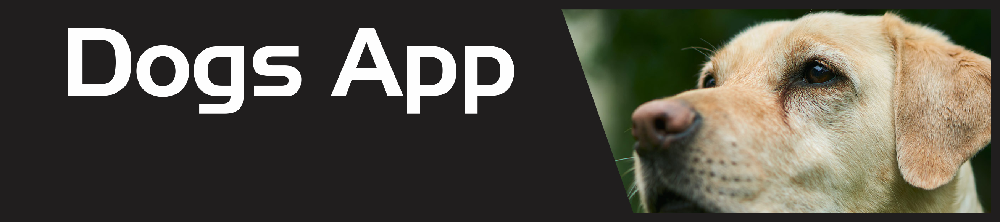
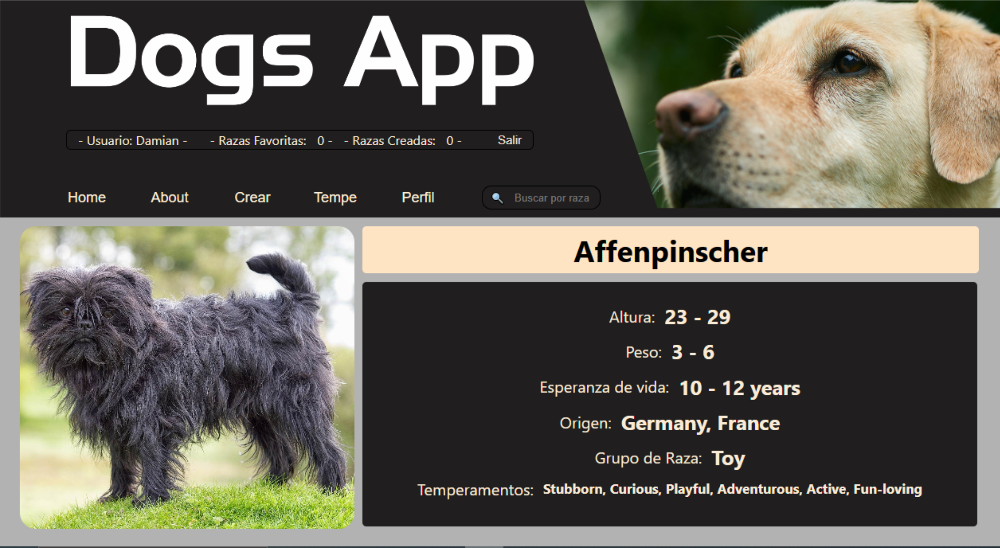
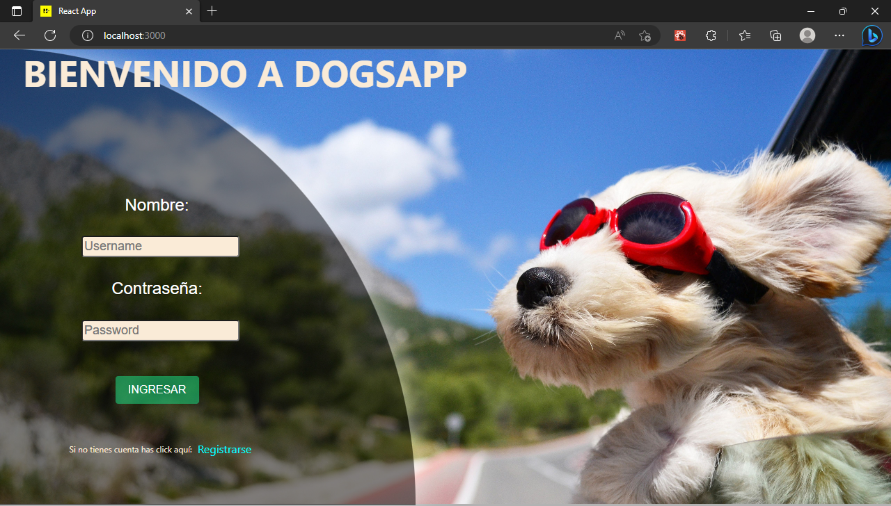
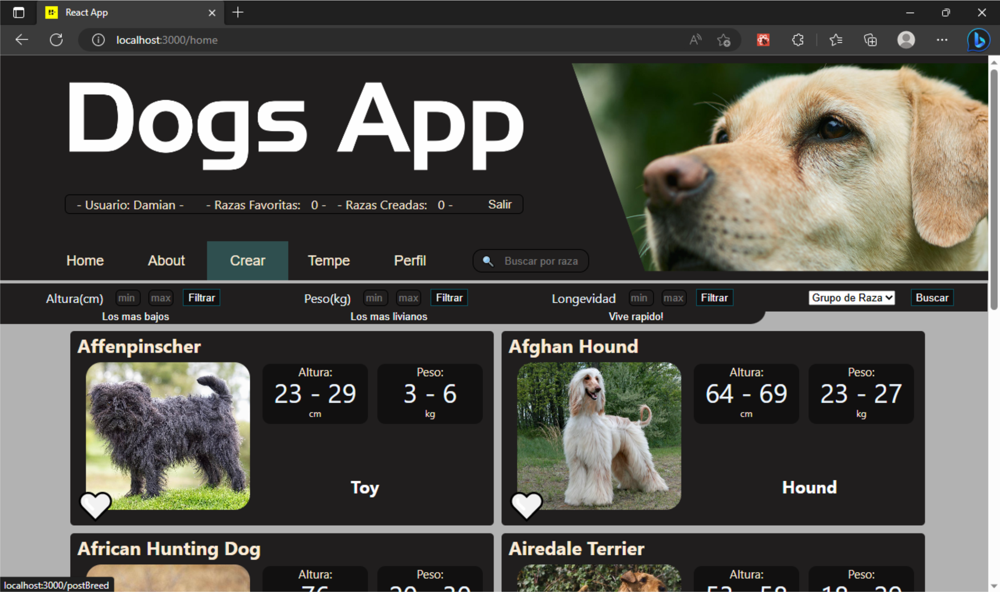
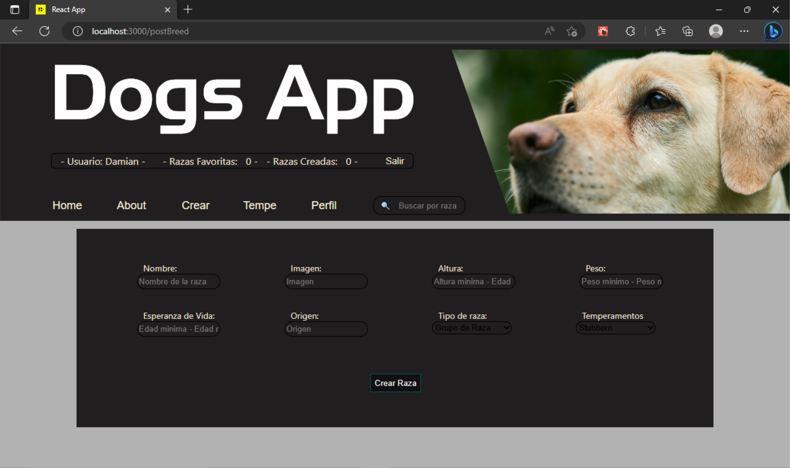

# **Henry** | Proyecto Individual

## **Descripción**

Desarrollé una app con los conocimientos adquiridos en Henry.
Dicha app consigue la informacion de una api llamada TheDogsApi, y guarda informacion en su propia base de datos
El tiempo que tuve para desarrolarla fueron 3 semanas.

<br />

---

## **Funcionalidades**


En la app se puede:
- Loguearse o registrarse 
- Ver la información de distintas razas de perros y una imagen de un ejemplar a travez de una card

Estas card se pueden:
- Filtrar y ordenar por:  esperanza de vida, peso y altura.
- Buscar por el nombre de la raza
- Agregar a una lista de favoritos propia de cada usuario
- Crear nuevas con nuevas razas de perros

En el perfil del usuario:
- Se ven las card elegidas como favoritas
- Se ven las card creadas por el usuario


<br />

---


## **Tecnologias usadas**

- React
- Redux
- Express
- Sequalize
- PostgreSQL

<br />

---

## **PARA COMENZAR...**

   ```bash
   npm install
   npm start
   ```
Ejecutar estos comandos posicionados a la altura del package.json tanto del front(client) como del back(api)

<br />

---

## **Capturas de la app**





